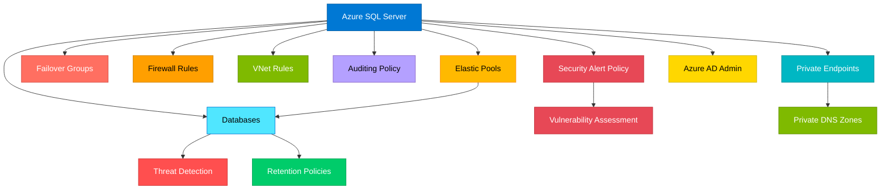

# terraform-azure-sql-database

Production-ready Terraform module for deploying Azure SQL Database with server management, elastic pools, failover groups, auditing, threat detection, transparent data encryption, firewall rules, VNet rules, and AD admin integration.

## Architecture



## Features

- SQL Server with configurable version, TLS, and connection policy
- Azure AD administrator integration with optional AAD-only authentication
- Managed identity support (SystemAssigned and UserAssigned)
- Elastic pools with configurable SKU and per-database settings
- Databases with flexible SKU, retention policies, and threat detection
- Failover groups for high availability with automatic/manual failover
- Transparent data encryption with optional customer-managed keys
- Server-level auditing policy with storage and Log Analytics
- Security alert policy (threat detection) with email notifications
- Vulnerability assessment with recurring scan support
- Firewall rules and VNet service endpoint rules
- Private endpoint connectivity with DNS zone groups

## Usage

```hcl
module "sql_database" {
  source = "path/to/terraform-azure-sql-database"

  server_name                  = "sql-myapp-prod"
  resource_group_name          = "rg-myapp"
  location                     = "East US"
  administrator_login          = "sqladmin"
  administrator_login_password = var.sql_password

  databases = {
    "app-db" = {
      sku_name    = "S1"
      max_size_gb = 50
    }
  }

  tags = {
    Environment = "production"
  }
}
```

## Examples

- [Basic](./examples/basic/) - Simple server with a single database
- [Advanced](./examples/advanced/) - Elastic pools, AD admin, auditing, and threat detection
- [Complete](./examples/complete/) - Full production setup with failover groups, private endpoints, and vulnerability assessment

## Requirements

| Name | Version |
|------|---------|
| terraform | >= 1.3.0 |
| azurerm | >= 3.80.0 |

## Inputs

| Name | Description | Type | Default | Required |
|------|-------------|------|---------|----------|
| server_name | The name of the SQL Server | `string` | n/a | yes |
| resource_group_name | The resource group name | `string` | n/a | yes |
| location | The Azure region | `string` | n/a | yes |
| administrator_login | Admin login name | `string` | `null` | no |
| administrator_login_password | Admin login password | `string` | `null` | no |
| databases | Map of databases to create | `map(object)` | `{}` | no |
| elastic_pools | Map of elastic pools | `map(object)` | `{}` | no |
| failover_groups | Map of failover groups | `map(object)` | `{}` | no |
| firewall_rules | Map of firewall rules | `map(object)` | `{}` | no |
| vnet_rules | Map of VNet rules | `map(object)` | `{}` | no |
| azuread_administrator | Azure AD admin config | `object` | `null` | no |
| auditing_policy | Auditing policy config | `object` | `null` | no |
| security_alert_policy | Security alert config | `object` | `null` | no |
| private_endpoints | Private endpoints | `map(object)` | `{}` | no |
| tags | Tags to assign | `map(string)` | `{}` | no |

## Outputs

| Name | Description |
|------|-------------|
| server_id | The ID of the SQL Server |
| server_name | The name of the SQL Server |
| server_fqdn | The FQDN of the SQL Server |
| database_ids | Map of database names to IDs |
| elastic_pool_ids | Map of elastic pool names to IDs |
| failover_group_ids | Map of failover group names to IDs |
| private_endpoint_ids | Map of private endpoint names to IDs |

## License

MIT License - see [LICENSE](./LICENSE) for details.
